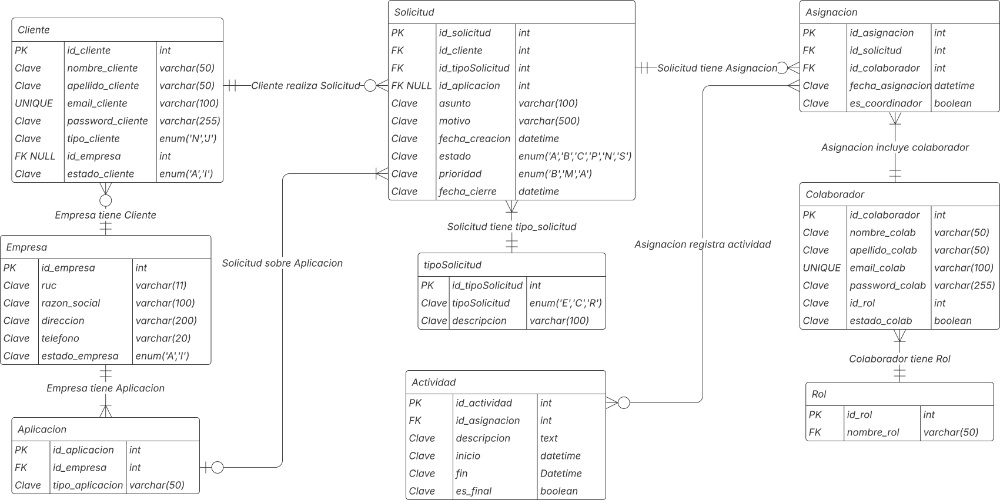

# DOCUMENTACION: Sistema de Gestión de Tickets de Soporte

---

Sistema web para la gestión de solicitudes de soporte técnico, registro de actividades, asignación de tickets a colaboradores y cierre de incidencias.

**Tecnologías:** Java EE (CDI, JSF), PrimeFaces, PostgreSQL, JDBC, Lombok

---

## Índice

- [Descripción general](#descripci%C3%B3n-general)
- [Modelo de Datos](#modelo-de-datos)
- [Estructura del Proyecto](#estructura-del-proyecto)
- [Configuración y despliegue](#configuraci%C3%B3n-y-despliegue)
- [Detalles de la implementación](#detalles-de-la-implementaci%C3%B3n)
    - [DTOs](#dtos)
    - [DAOs](#daos)
    - [Beans](#beans)
    - [Frontend (JSF + PrimeFaces)](#frontend-jsf--primefaces)
    - [Control de estados y permisos](#control-de-estados-y-permisos)
- [Flujos de usuario](#flujos-de-usuario)
- [Capturas de pantalla](#capturas-de-pantalla-opcional)
- [Consideraciones técnicas y buenas prácticas](#consideraciones-t%C3%A9cnicas-y-buenas-pr%C3%A1cticas)
- [Posibles mejoras](#posibles-mejoras)
- [Autores y agradecimientos](#autores-y-agradecimientos)

---

## Descripción general

Este sistema permite:

- Registrar y gestionar tickets (solicitudes) de clientes.
- Asignar tickets a colaboradores, incluyendo el rol de coordinador.
- Registrar y consultar actividades sobre cada ticket.
- Cerrar tickets marcando la última actividad como finalizada.
- Control de permisos y flujos según tipo de usuario (cliente, colaborador, coordinador).

---

## Modelo de Datos

### Diagrama Entidad Relación


### Esquema de tablas principales

- **Empresa**: Información de la empresa cliente.
- **Aplicacion**: Aplicaciones para las cuales se solicita soporte.
- **Cliente**: Usuarios finales que reportan solicitudes.
- **Rol**: Define si un colaborador es técnico, coordinador, etc.
- **Colaborador**: Soporte/atención del sistema.
- **Solicitud**: El ticket o incidente reportado.
- **Asignacion**: Relación entre ticket y colaborador, con rol de coordinador.
- **Actividad**: Acciones realizadas sobre una asignación de ticket.

### Relaciones

- Una empresa puede tener varias aplicaciones y clientes.
- Una solicitud puede estar relacionada con una aplicación y un cliente.
- Cada solicitud puede tener varias asignaciones (historial de quién la atiende).
- Cada asignación puede tener varias actividades.
- Las actividades marcan el avance y solución del ticket.

### Tipos ENUM usados en PostgreSQL

- `estado_enum`: Estados generales de entidades (Activo/Inactivo).
- `tipo_cliente_enum`: Tipo de cliente (Natural/Jurídico).
- `estado_solicitud_enum`: Estados de ticket (`A`bierto, `B`asignado, `S`olucionado, etc).
- `prioridad_enum`: Prioridad de la solicitud (`B`aja, `M`edia, `A`lta).
- `tipo_solicitud_enum`: Tipo de ticket (Error, Capacitación, Requerimiento).

### Ejemplo: Tabla Actividad

```sql
CREATE TABLE Actividad (
    id_actividad SERIAL PRIMARY KEY,
    id_asignacion INT NOT NULL,
    descripcion TEXT,
    inicio TIMESTAMP DEFAULT CURRENT_TIMESTAMP,
    fin TIMESTAMP,
    es_final BOOLEAN DEFAULT FALSE,
    FOREIGN KEY (id_asignacion) REFERENCES Asignacion(id_asignacion) ON DELETE RESTRICT
);

```

---

## Estructura del Proyecto

```
src/
 └── main/
     ├── java/
     │    └── utp.edu.pe.isi.dwi.sistematickets/
     │         ├── bean/         // Beans JSF CDI
     │         ├── dao/          // Acceso a datos (JDBC)
     │         ├── dto/          // Objetos de transferencia
     │         └── enums/        // Enums para estados, roles, etc.
     ├── resources/
     └── webapp/
          ├── WEB-INF/
          │    └── web.xml
          └── pages/
               ├── dashboardColaborador.xhtml
               ├── dashboardCliente.xhtml
               ├── login.xhtml

```

---

## Configuración y despliegue

### Requisitos

- **Java 17** (o superior, según tu servidor)
- **Apache TomEE** 10.x o cualquier servidor compatible Jakarta EE 10
- **PostgreSQL** 13+
- **Maven** (para compilar)
- **PrimeFaces** 13.x

### Configuración de Base de Datos

1. Crear los tipos ENUM y tablas siguiendo el [modelo de datos](#modelo-de-datos).
2. Configurar las credenciales de la base de datos en los DAOs (o mejor: usar un datasource configurado en TomEE).

### Despliegue

1. Clona el repositorio y configura el archivo `pom.xml` con tus dependencias.
2. Compila el proyecto con `mvn clean package`.
3. Despliega el archivo WAR generado en TomEE.
4. Asegúrate que tu base de datos está accesible desde el servidor.

---

## Detalles de la implementación

### DTOs

- Son POJOs que encapsulan los datos y evitan exponer directamente la estructura de la base de datos.
- Ejemplo: `ActividadDTO` contiene información de la actividad, asignación y colaborador.

```java
@Data
public class ActividadDTO {
    private Integer idActividad;
    private Integer idAsignacion;
    private String descripcion;
    private Timestamp inicio;
    private Timestamp fin;
    private Boolean esFinal;
    // Extras para mostrar en la UI
    private Integer idColaborador;
    private String nombreColaborador;
}

```

### DAOs

- Manejan la lógica de acceso a datos usando JDBC puro.
- Métodos principales: listar, insertar, actualizar, eliminar (CRUD).
- Uso de consultas con JOIN para obtener datos compuestos (por ejemplo, actividades + nombre del colaborador).

```java
public List<ActividadDTO> listarActividadesPorSolicitud(int idSolicitud) {
    String sql = "SELECT act.*, colab.nombre_colab, colab.apellido_colab, asg.id_colaborador "
               + "FROM Actividad act "
               + "JOIN Asignacion asg ON act.id_asignacion = asg.id_asignacion "
               + "LEFT JOIN Colaborador colab ON asg.id_colaborador = colab.id_colaborador "
               + "WHERE asg.id_solicitud = ? "
               + "ORDER BY act.inicio ASC";
    // ...
}

```

### Beans

- Cada entidad principal tiene un Bean para manejar la lógica de negocio y exponer propiedades a la UI.
- Los Beans usan `@Named` y scopes adecuados (`@SessionScoped`, etc).
- Ejemplo: `ActividadBean` maneja la lógica de registrar y listar actividades, así como bloquear el registro si el ticket ya está solucionado.

```java
@Named("actividadBean")
@SessionScoped
public class ActividadBean implements Serializable {
    // ...
    public boolean ticketEstaSolucionado() {
        List<ActividadDTO> acts = getActividadesPorSolicitud();
        if (acts != null) {
            for (ActividadDTO act : acts) {
                if (Boolean.TRUE.equals(act.getEsFinal())) return true;
            }
        }
        return false;
    }
}

```

### Frontend (JSF + PrimeFaces)

- Uso de `<p:dataTable>` para listar tickets y actividades.
- Modales (`<p:dialog>`) para editar tickets, asignar colaboradores y registrar actividades.
- Ejemplo de actividades:

```xml
<p:dialog header="Actividades del Ticket" widgetVar="dlgActividades" modal="true">
    <h:form id="formActividades">
        <p:dataTable value="#{actividadBean.actividadesPorSolicitud}" var="act">
            <p:column headerText="Fecha">
                <h:outputText value="#{act.inicio}">
                    <f:convertDateTime pattern="dd/MM/yyyy HH:mm" />
                </h:outputText>
            </p:column>
            <p:column headerText="Colaborador">
                <h:outputText value="#{act.nombreColaborador}" />
            </p:column>
            <p:column headerText="Descripción">
                <h:outputText value="#{act.descripcion}" />
            </p:column>
        </p:dataTable>
        <h3>Registrar Nueva Actividad</h3>
        <h:panelGrid columns="1">
            <p:inputTextarea value="#{actividadBean.nuevaActividad.descripcion}" />
        </h:panelGrid>
        <h:outputText value="¿Es la última actividad?"/>
        <p:selectBooleanCheckbox value="#{actividadBean.nuevaActividad.esFinal}" />
        <p:commandButton value="Registrar"
                         action="#{actividadBean.registrarActividad}"
                         update="formActividades"
                         disabled="#{actividadBean.ticketEstaSolucionado()}"/>
        <h:outputText value="Este ticket ya está solucionado. No se pueden agregar más actividades."
                      rendered="#{actividadBean.ticketEstaSolucionado()}" style="color: red;"/>
    </h:form>
</p:dialog>

```

### Control de estados y permisos

- **Solo el coordinador** (asignación con `es_coordinador=true`) puede reasignar tickets.
- **Solo se puede registrar actividades mientras el ticket esté abierto** (no tiene actividad marcada como final).
- **Cierre automático:** Si se registra una actividad marcada como “final”, el estado del ticket cambia a `S` (Solucionado), y no se pueden registrar más actividades.
- **Validaciones y mensajes** claros en la interfaz.

---

## Flujos de usuario

**1. Cliente**

- Ingresa y registra un ticket.
- Ve el estado de sus tickets y actividades asociadas.

**2. Colaborador**

- Ve tickets asignados.
- Registra actividades conforme avanza la atención.
- Si es coordinador, puede asignar tickets a otros.

**3. Cierre de ticket**

- Al registrar la última actividad (`es_final=true`), el ticket se marca como solucionado y se bloquea el registro de más actividades.

---

## Errores comunes y troubleshooting

### 1. **No se muestran actividades en la UI**

- **Causa común:** El método `getActividadesPorSolicitud` retorna `null` o lista vacía, o no se está actualizando correctamente el valor de `idSolicitudSeleccionada`.
- **Solución:** Asegúrate de setear `actividadBean.setIdSolicitudSeleccionada(ticket.idSolicitud)` antes de abrir el modal y que la consulta SQL funciona para ese ticket.

### 2. **La fecha/hora de la actividad aparece vacía**

- **Causa común:** El campo `inicio` en la tabla `Actividad` no se setea automáticamente.
- **Solución:** Usa `DEFAULT CURRENT_TIMESTAMP` en el campo o ajusta el INSERT en el DAO para pasar `NOW()` desde SQL.

### 3. **No se puede registrar actividades (“ya está solucionado” aunque no lo está)**

- **Causa común:** El método que evalúa si el ticket está solucionado retorna `true` porque una actividad previa tiene `es_final = true`, o la lista no se refresca luego de registrar.
- **Solución:** Asegúrate de recargar la lista tras registrar, y revisa que el método `ticketEstaSolucionado()` realmente solo marca como solucionado si alguna actividad tiene ese flag.

### 4. **Error de enums en PostgreSQL**

- Ejemplo: `column "estado" is of type estado_solicitud_enum but expression is of type character varying`
- **Solución:** Usa casteos correctos en SQL (`estado=?::estado_solicitud_enum`), y siempre pasa el `name()` del Enum Java (no el label ni el value).

### 5. **Error de claves foráneas en inserciones**

- **Causa común:** Se intenta registrar actividad con una asignación inexistente o nula.
- **Solución:** Asegúrate que `id_asignacion` exista, y usa IDs válidos en el DTO antes del insert.

### 6. **Problemas con session/refresh en PrimeFaces**

- **Causa:** Los formularios no se actualizan tras ciertas acciones.
- **Solución:** Usa siempre `update="formActividades"` y verifica que el scope del bean sea adecuado (`@SessionScoped` o `@ViewScoped` según tu caso).

---

## Consideraciones técnicas y buenas prácticas

- **Separación de capas**: DTO, DAO, Bean, UI claramente separados.
- **Uso de scopes**: SessionScoped para beans que deben persistir info entre requests de usuario.
- **SQL parametrizado**: Evita SQL Injection.
- **Código limpio**: Uso de Lombok para DTOs, métodos bien documentados, manejo de excepciones.
- **Formateo de fechas**: Siempre usar `<f:convertDateTime>` en la UI.
- **Mensajes claros**: Uso de `<p:messages>` o `<h:messages>`.

---

## Posibles mejoras

- Agregar logs detallados para auditoría.
- Implementar sistema de notificaciones por email.
- Integrar autenticación y autorización más avanzada.
- Uso de DataSource externo en lugar de credenciales embebidas.
- Refactorizar lógica de negocio a servicios EJB.
- Tests unitarios y de integración.
- Versión responsiva/móvil.

---

## Autores y agradecimientos

- **Universidad:** Universidad Tecnológica del Perú
- **Docente:** Omar Wilton Saavedra Salazar
- **Curso:** Desarrollo Web Integrado
- **Líder de Desarrollo:** Luis Gustavo Oscorima
- **Integrantes:** 
Oscorima Palomino, Luis Gustavo - U21313503
Palacios Mendoza Lucerito - U1601142
Villanueva Vasquez, Diego Alejandro - U18208860
Zinanyuca Clemente, Marcio Adriell - U22218661

- **Agradecimientos:** Al Docente por su paciencia y a mis compañeros por el apoyo en el desarrollo.

---
